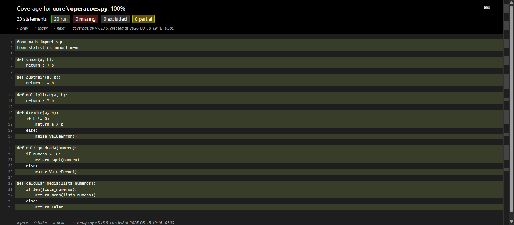
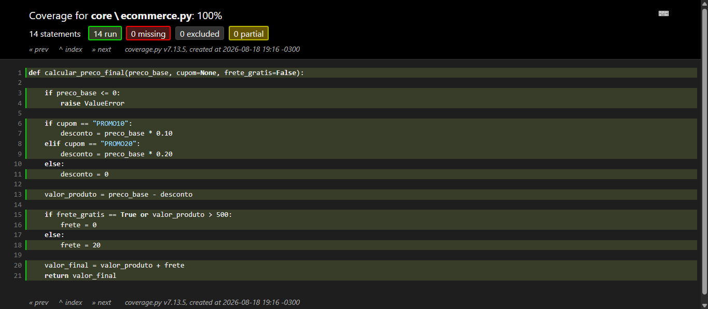

# ATS03 — Testes automatizados com `pytest`

Terceira entrega da disciplina **Automação de Testes de Software**. O projeto implementa funções em Python com testes automatizados usando [`pytest`](https://docs.pytest.org/) e medição de cobertura com [`pytest-cov`](https://pytest-cov.readthedocs.io/).

## Objetivo

Desenvolver e validar:

- operações matemáticas básicas com tratamento de erros;
- cálculo de média e raiz quadrada;
- lógica de preço final em um e-commerce (cupons e frete);
- suíte de testes com cobertura de código.

## Estrutura

```text
ATS/ATS03/
├── core/
│   ├── operacoes.py          # Funções matemáticas
│   └── ecommerce.py          # Cálculo de preço final
├── tests/
│   ├── test_operacoes.py
│   └── test_ecommerce.py
├── assets/
│   ├── Exercício ATS03.pdf   # Enunciado da atividade
│   ├── coverage_operacoes.png
│   └── coverage_ecommerce.png
├── requirements.txt
└── README.md
```

## Módulos

### Operações matemáticas

**Arquivo:** [core/operacoes.py](core/operacoes.py)

| Função | Descrição |
|--------|-----------|
| `somar(a, b)` | Soma de dois números |
| `subtrair(a, b)` | Subtração |
| `multiplicar(a, b)` | Multiplicação |
| `dividir(a, b)` | Divisão; `ValueError` se divisor = 0 |
| `raiz_quadrada(numero)` | Raiz quadrada; `ValueError` se número < 0 |
| `calcular_media(lista_numeros)` | Média aritmética; retorna `False` se lista vazia |

### E-commerce — preço final

**Arquivo:** [core/ecommerce.py](core/ecommerce.py)

Função `calcular_preco_final(preco_base, cupom=None, frete_gratis=False)`:

| Regra | Comportamento |
|-------|---------------|
| Preço base | Deve ser > 0, senão `ValueError` |
| `PROMO10` | 10% de desconto |
| `PROMO20` | 20% de desconto |
| Cupom inválido | Sem desconto |
| Frete grátis | Se `frete_gratis=True` ou valor após desconto > R$ 500 |
| Frete padrão | R$ 20,00 |

## Requisitos

```bash
cd ATS/ATS03
python3 -m venv .venv
source .venv/bin/activate
pip install -r requirements.txt
```

Dependências:

- `pytest`
- `pytest-cov`

## Como executar os testes

```bash
# Suíte completa
pytest

# Com detalhes
pytest -v

# Com cobertura no terminal
pytest -v --cov=. --cov-branch

# Relatório HTML de cobertura
coverage html
# Abra htmlcov/index.html no navegador
```

Saída esperada: **18 testes** executados com sucesso.

## Suíte de testes

### Operações matemáticas — [tests/test_operacoes.py](tests/test_operacoes.py)

- soma, subtração, multiplicação e divisão;
- divisão por zero;
- raiz quadrada positiva e negativa;
- média exata, aproximada e lista vazia.



### E-commerce — [tests/test_ecommerce.py](tests/test_ecommerce.py)

- preço base válido e inválido;
- cupons `PROMO10` e `PROMO20`;
- cupom inválido;
- frete grátis por parâmetro e por valor;
- valores decimais com `pytest.approx`.



## Cobertura de testes

A cobertura indica quais linhas e ramos do código foram executados durante os testes. Neste projeto, ela valida se as regras de negócio em `core/operacoes.py` e `core/ecommerce.py` estão sendo exercitadas.

| Comando | Resultado |
|---------|-----------|
| `pytest -v --cov=. --cov-branch` | Resumo percentual no terminal |
| `coverage html` | Relatório interativo em `htmlcov/` |

## Autor

**Ryan Rodrigues Cordeiro**
